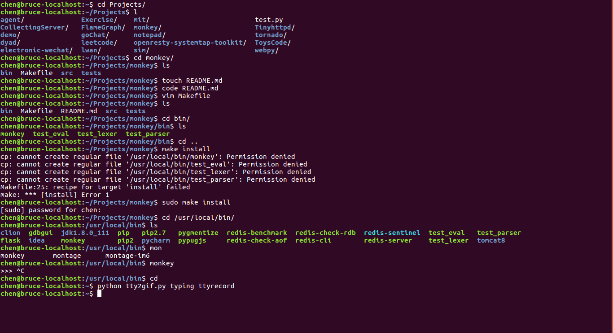

## Monkey is a small script langaugae

Monkey is a toy language which  can be used to learn some compiler theory for me. It's implemented by Pratt Parsers and a Tree-walking evaluation.

## Compile and Install
```
$ git clone git@github.com:BruceChen7/monkey.git ~/
$ cd ~/
$ make
$ sudo make install
```
After monkey is installed in the **/usr/local/bin** directory, you can type **monkey** to exec Monkey script.



## Features

```
let add = fn(x, y) { x + y ;} 
add(2, 3)   // 5

let a = 1;
let b = 2;
a + b  // 3

if( 2 > 1) { 1 } else { 2 }  // 1

```

* Support **variable binding, function, if-else clause**
* Support **integer, boolean type**
* Support **common arithmetic expression(+ - * /) and relationship expression ( > < != == )**

## tasks to be done
- [x] Support annotations features
- [ ] Support strings
- [ ] Suport arrays
- [ ] Support built-in functions
- [ ] Support hashes
- [ ] Support macros

## Material to be read
* [Pratt Parsers: Expression Parsing Made Easy](http://journal.stuffwithstuff.com/2011/03/19/pratt-parsers-expression-parsing-made-easy/)
* [simle-top-down-parsing in python](http://effbot.org/zone/simple-top-down-parsing.htm)
* [Writing an interpreter in go](https://interpreterbook.com/)